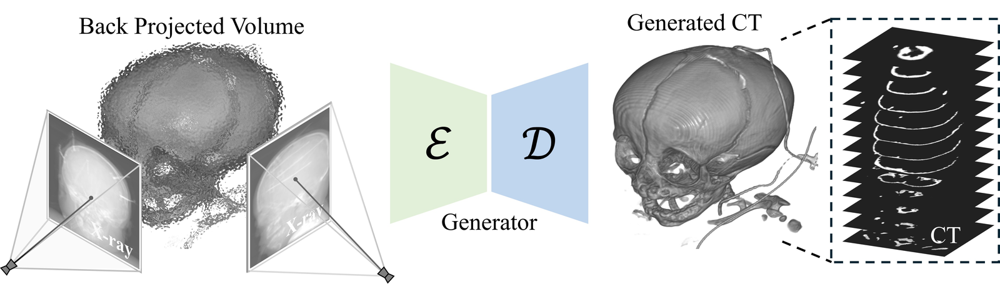
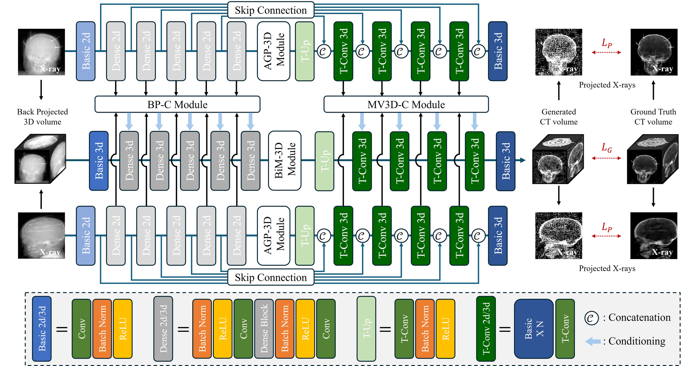
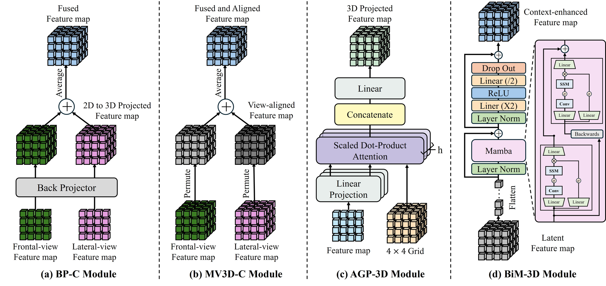
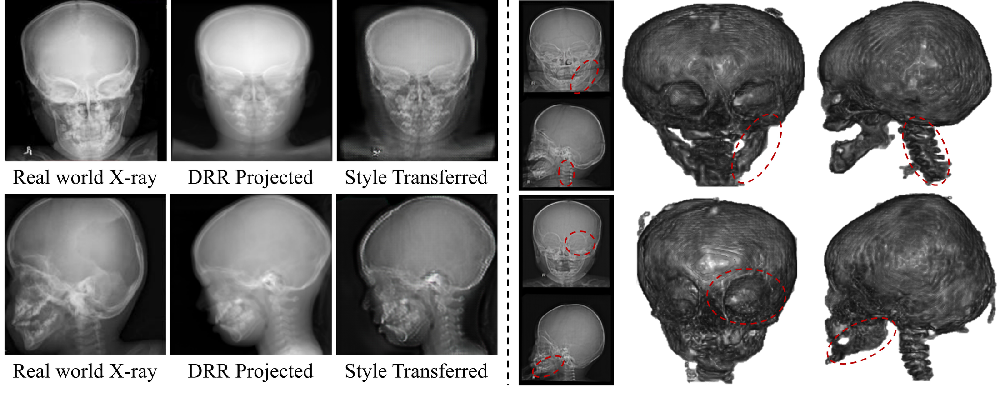
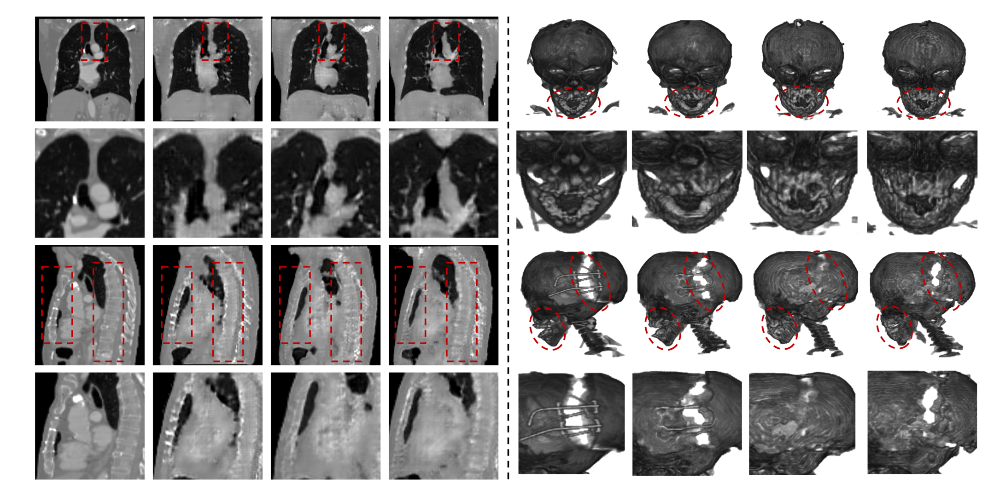

# PSCT-Net
### Geometry-Aware Pediatric Skull CT Reconstruction via Differentiable Back-Projection and Attention-Guided Refinement

[](https://arxiv.org/abs/2606.19867)
[](https://dydevelop.github.io/PSCT-Net/)
[](#installation)
[](#installation)
[](#installation)

Official implementation of **PSCT-Net**, a geometry-aware framework for reconstructing 3D pediatric skull CT volumes from **bi-planar X-rays**.

PSCT-Net uses differentiable back-projection to inject acquisition geometry into the reconstruction pipeline, then refines the resulting volumetric prior with attention-guided feature lifting and efficient bidirectional state-space modeling.

> **Data note.** PedSkull-CT is a private institutional pediatric skull CT cohort used for internal evaluation. It is not redistributed in this repository.

---

## Overview

Computed tomography is central to pediatric craniofacial assessment, but CT radiation exposure is a practical concern in young patients. Bi-planar X-rays provide a lower-dose alternative, yet reconstructing 3D anatomy from two sparse 2D projections is severely ill-posed.

PSCT-Net addresses this by replacing geometry-agnostic 2D-to-3D lifting with explicit geometric initialization and multi-view conditioning.



### Highlights

- **Geometry-aware volumetric initialization**: frontal and lateral X-rays are differentiably back-projected to form a coarse 3D prior.
- **Multi-view geometric conditioning**: BP-C and MV3D-C modules repeatedly inject view geometry into encoder and decoder stages.
- **Attention-guided projection**: AGP-3D learns non-linear correspondences between 2D image regions and 3D voxel locations.
- **Efficient global context modeling**: BiM-3D captures long-range volumetric dependencies with linear-complexity state-space modeling.
- **Broad evaluation**: experiments cover LIDC-IDRI, CTSpine1K, CTPelvic1K, and the private PedSkull-CT cohort.

---

## Links

| Resource | Status | Link |
|---|---:|---|
| Project page | Available | [dydevelop.github.io/PSCT-Net](https://dydevelop.github.io/PSCT-Net/) |
| Code | Available | [github.com/DYDevelop/PSCT-Net](https://github.com/DYDevelop/PSCT-Net) |
| Paper | Available | [arXiv:2606.19867](https://arxiv.org/abs/2606.19867) |
| PedSkull-CT | Private | Institutional cohort; not publicly released |
| Public benchmarks | External | [LIDC-IDRI](https://wiki.cancerimagingarchive.net/display/Public/LIDC-IDRI), [CTSpine1K](https://github.com/MIRACLE-Center/CTSpine1K), [CTPelvic1K](https://github.com/MIRACLE-Center/CTPelvic1K) |

---

## Method

PSCT-Net is built around a 2D-to-3D conditional GAN backbone augmented with explicit geometry and efficient volumetric context modeling.



### 1. Differentiable back-projection initialization

The frontal and lateral X-rays are back-projected according to their acquisition geometry to produce a coarse but spatially meaningful volumetric prior. This reduces depth ambiguity before the generator begins refinement.

```text
V_prior = BP(I_frontal, M_frontal) + BP(I_lateral, M_lateral)
```

### 2. Geometry-aware multi-view conditioning

The network does not rely on a single geometric injection. It repeatedly conditions reconstruction features with view-aware information.

- **BP-C module**: back-projects 2D feature maps into 3D space and fuses them at the encoder level.
- **MV3D-C module**: aligns view-specific volumetric features in the decoder and merges them in a common coordinate system.

### 3. Attention-Guided Projection (AGP-3D)

AGP-3D treats 3D voxel-grid locations as queries and 2D feature tokens as keys and values. This allows the network to learn non-uniform 2D-to-3D correspondence instead of blindly replicating pixels along projection rays.

```text
V_out = Reshape(MultiHeadAttention(q_3D, x_2D, x_2D))
```

### 4. Bidirectional Mamba (BiM-3D)

BiM-3D flattens volumetric features into a token sequence and applies bidirectional selective state-space modeling. It provides global receptive fields with linear complexity.

```text
x'    = x  + Bi-SSM(LN(x))
x_out = x' + FFN(LN(x'))
```



### 5. Training objective

PSCT-Net is trained with a compound reconstruction, projection-consistency, and adversarial objective.

```text
L = lambda_adv * L_adv + lambda_rec * L_rec + lambda_proj * L_proj
```

The reported experiments use `(lambda_adv, lambda_rec, lambda_proj) = (0.1, 10, 10)`.

---

## Datasets

### Private PedSkull-CT cohort

PedSkull-CT is a private institutional cohort designed for internal validation of pediatric cranial reconstruction.

| Property | Details |
|---|---|
| Modality | Pediatric skull CT |
| Size | 982 CT scans |
| Age range | 1-24 months |
| Split | 883 training / 99 testing |
| Preprocessing | 1 mm isotropic resampling, resize to 128^3 voxels |
| Bone extraction | HU thresholding > 200, min-max normalization to [0, 1] |
| X-ray synthesis | DRR generation and CycleGAN-based style transfer |
| Release | Private; not redistributed |



### Public benchmarks

To evaluate anatomical generalization, PSCT-Net is also tested on public CT reconstruction benchmarks.

| Dataset | Anatomy | Split used in paper |
|---|---|---:|
| LIDC-IDRI | Thorax | 917 train / 101 test |
| CTSpine1K | Spine | 904 train / 101 test |
| CTPelvic1K | Pelvis | 424 train / 43 test |

---

## Results

### Public benchmark performance

| Dataset | Metric | ReconNet | X-CTRSNet | X2CT-GAN | TRCT-GAN | BX2S-Net | DiffuX2CT | **PSCT-Net** |
|---|---|---:|---:|---:|---:|---:|---:|---:|
| LIDC-IDRI | PSNR ↑ | 17.42 | 19.73 | 26.03 | 26.14 | 22.18 | 26.35 | **27.18** |
| LIDC-IDRI | PSNR3D ↑ | 11.07 | 17.81 | 21.64 | 21.43 | 20.71 | 21.15 | **22.14** |
| LIDC-IDRI | SSIM ↑ | 0.310 | 0.541 | 0.645 | 0.632 | 0.556 | **0.687** | 0.671 |
| LIDC-IDRI | LPIPS ↓ | 0.698 | 0.388 | 0.114 | 0.120 | 0.463 | 0.122 | **0.102** |
| CTSpine1K | PSNR ↑ | 18.01 | 18.81 | 20.82 | 21.57 | 20.76 | 21.53 | **21.86** |
| CTSpine1K | PSNR3D ↑ | 17.57 | 18.36 | 20.23 | 20.95 | 20.25 | 21.12 | **21.15** |
| CTSpine1K | SSIM ↑ | 0.395 | 0.394 | 0.425 | 0.456 | 0.463 | **0.592** | 0.511 |
| CTSpine1K | LPIPS ↓ | 0.708 | 0.631 | 0.223 | 0.211 | 0.641 | **0.167** | 0.199 |
| CTPelvic1K | PSNR ↑ | 30.49 | 13.86 | 31.71 | 30.97 | 30.34 | 23.91 | **33.06** |
| CTPelvic1K | PSNR3D ↑ | 25.86 | 13.23 | 28.53 | 27.80 | 27.62 | 23.27 | **29.03** |
| CTPelvic1K | SSIM ↑ | 0.622 | 0.213 | 0.753 | 0.746 | 0.700 | 0.658 | **0.786** |
| CTPelvic1K | LPIPS ↓ | 0.465 | 0.651 | 0.113 | 0.115 | 0.465 | 0.169 | **0.108** |

### Private PedSkull-CT performance

| Method | PSNR ↑ | PSNR3D ↑ | SSIM ↑ | LPIPS ↓ |
|---|---:|---:|---:|---:|
| ReconNet | 25.22 | 23.04 | 0.633 | 0.537 |
| X-CTRSNet | 24.27 | 22.72 | 0.788 | 0.498 |
| X2CT-GAN | 30.21 | 26.61 | 0.860 | 0.113 |
| TRCT-GAN | 29.92 | 26.12 | 0.847 | 0.123 |
| BX2S-Net | 29.73 | 26.77 | 0.777 | 0.298 |
| **PSCT-Net** | **31.49** | **28.03** | **0.882** | **0.100** |



### Ablation study on LIDC-IDRI

| BP-I | BP-C | AGP | BiM | PSNR ↑ | SSIM ↑ |
|:---:|:---:|:---:|:---:|---:|---:|
|  |  |  |  | 26.03 | 0.645 |
| ✓ |  |  |  | 26.30 | 0.647 |
| ✓ | ✓ |  |  | 26.40 | 0.648 |
|  |  | ✓ |  | 26.92 | 0.649 |
|  |  |  | ✓ | 27.07 | 0.665 |
| ✓ | ✓ | ✓ |  | 26.85 | 0.651 |
| ✓ | ✓ |  | ✓ | 27.16 | 0.669 |
| ✓ | ✓ | ✓ | ✓ | **27.18** | **0.671** |

---

## Installation

### 1. Create the conda environment

```bash
git clone https://github.com/DYDevelop/PSCT-Net.git
cd PSCT-Net

conda env create -f environment.yaml
conda activate BPJCT
```

### 2. Install the differentiable DRR/back-projection operator

```bash
cd drr_projector
python setup.py install
cd ..
```

### 3. Verify the environment

The released environment was tested with:

| Component | Version |
|---|---|
| Python | 3.10.18 |
| PyTorch | 2.4.1 |
| CUDA | 12.1 |
| cuDNN | 9.1+ |
| Mamba-SSM | 2.2.2 |

---

## Repository Structure

```text
PSCT-Net/
├── docs/                         # GitHub Pages project page
├── figures/                      # Paper/project figures used by README
├── drr_projector/                # CUDA/C++ differentiable projection operators
├── experiment/
│   └── multiview2500/
│       └── d2_multiview2500_BP.yml
├── lib/
│   ├── config/                   # Configuration utilities
│   ├── dataset/                  # Dataset and augmentation loaders
│   ├── model/                    # cGAN, generator, discriminator, loss definitions
│   └── utils/                    # Metrics, CT utilities, visualization helpers
├── train.py                      # Training entry point
├── test.py                       # Quantitative evaluation entry point
├── visual.py                     # Inference/visualization entry point
├── generation.py                 # Generation helper
├── generation_folder.py          # Folder-level generation helper
├── environment.yaml
└── README.md
```

---

## Usage

The commands below use placeholder paths. Replace dataset paths, checkpoint paths, and split files with local values.

### Test a trained model

```bash
python test.py \
  --ymlpath ./experiment/multiview2500/d2_multiview2500_BP.yml \
  --gpu 0 \
  --dataroot /path/to/preprocessed_hdf5 \
  --dataset test \
  --tag psctnet_multiview \
  --data LIDC256 \
  --dataset_class align_ct_xray_views_std \
  --model_class MultiViewCTGAN \
  --datasetfile /path/to/test.txt \
  --resultdir ./results/psctnet \
  --check_point 100 \
  --load_path /path/to/checkpoint_dir
```

### Train from scratch

```bash
python train.py \
  --ymlpath ./experiment/multiview2500/d2_multiview2500_BP.yml \
  --gpu 0 \
  --dataroot /path/to/preprocessed_hdf5 \
  --dataset train \
  --valid_dataset test \
  --tag psctnet_multiview \
  --data LIDC256 \
  --dataset_class align_ct_xray_views_std \
  --model_class MultiViewCTGAN \
  --datasetfile /path/to/train.txt \
  --valid_datasetfile /path/to/test.txt
```

### Visualize reconstructions

```bash
python visual.py \
  --ymlpath ./experiment/multiview2500/d2_multiview2500_BP.yml \
  --gpu 0 \
  --dataroot /path/to/preprocessed_hdf5 \
  --dataset test \
  --tag psctnet_multiview \
  --data LIDC256 \
  --dataset_class align_ct_xray_views_std \
  --model_class MultiViewCTGAN \
  --datasetfile /path/to/test.txt \
  --resultdir ./visual_results \
  --check_point 100 \
  --load_path /path/to/checkpoint_dir \
  --how_many 10
```

---

## Data and Model Release Notes

- **PedSkull-CT is private** and is not included in this repository.
- Public benchmark preprocessing should follow the same volume size, projection geometry, and train/test split protocol used in the paper.
- Pretrained weights can be added under a release or external model-hosting link. Update the `--load_path` examples after release.

---

## Citation

```bibtex
@misc{kim2026psctnet,
  title         = {PSCT-Net: Geometry-Aware Pediatric Skull CT Reconstruction via Differentiable Back-Projection and Attention-Guided Refinement},
  author        = {Kim, Dong Yeong and Choi, Jaewon and Shin, Youmin and Lee, Jungyu and Kim, Myeongseop and Choi, Jinwook and Kim, Joo Whan and Kim, Young-Gon},
  year          = {2026},
  eprint        = {2606.19867},
  archivePrefix = {arXiv},
  primaryClass  = {cs.CV}
}
```

---

## License and Data Terms

This repository is intended for research use. A finalized `LICENSE` file should be added before public release if it is not already present.

PedSkull-CT contains private institutional pediatric imaging data and is not distributed through this repository. Users must follow the access requirements and data-use terms of each external public dataset.

---

## Acknowledgements

This work was supported in part by the Seoul National University Hospital Research Fund (Grant No. 04-2024-0430) and the Korea Health Technology R&D Project through KHIDI, funded by the Ministry of Health & Welfare, Republic of Korea (Grant No. RS-2025-02307233).
